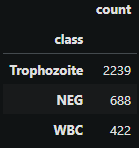
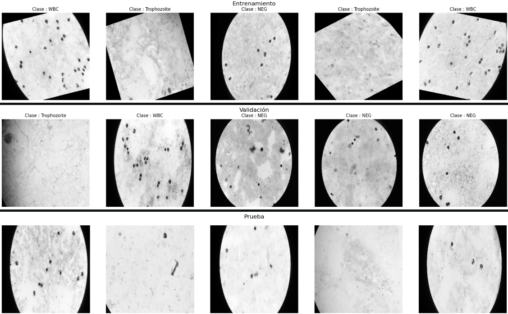
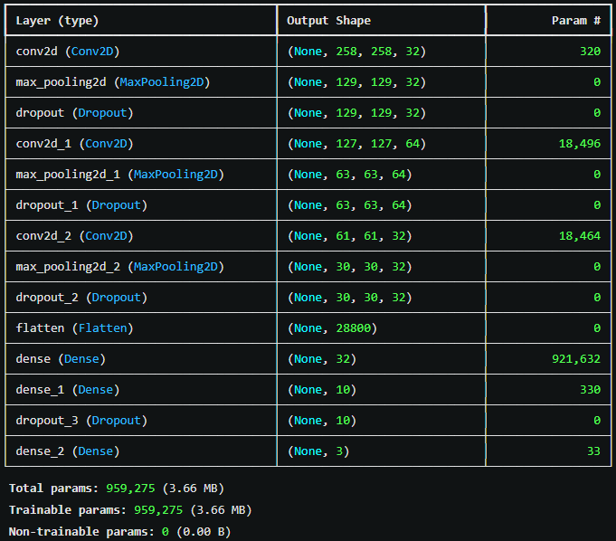
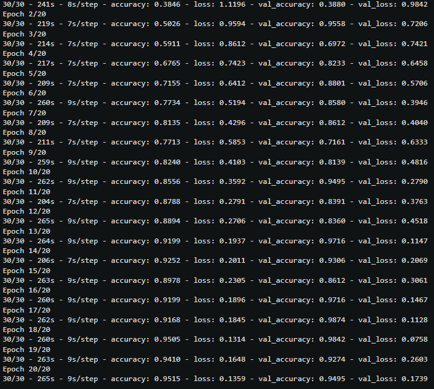
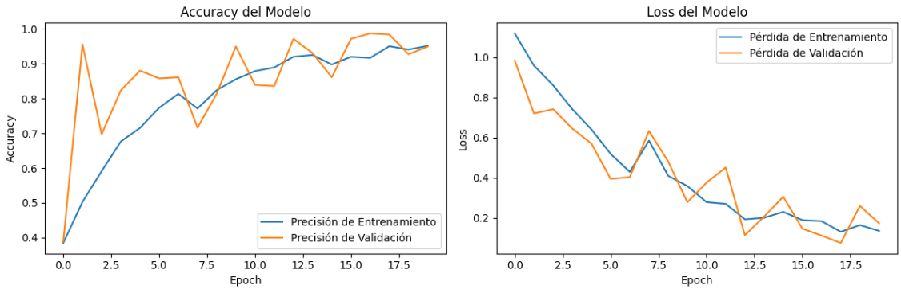
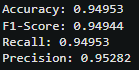
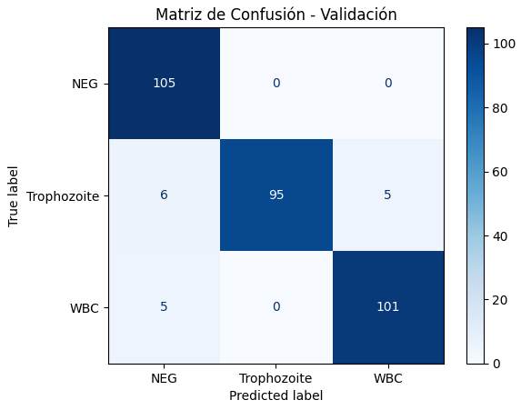
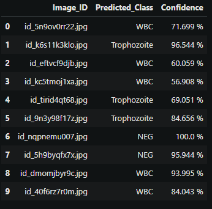

# Clasificación de Malaria

## Descripción:
Ente proyecto tiene como objetivo el detectar en las imágenes si existe la presencia de malaria o no en la sangre, haciendo uso de una Red Neuronal Convolucional (CNN).

## Tabla de Contenidos 
- [Datos](#datos)
- [Metodología](#metodología)
- [Resultados](#resultados)
- [Conclusiones](#conclusiones)

## Datos 
- El dataset utilizado proviene de "Kaggle", el dataser se llama [Lacuna Malaria Detection Challenge Dataset](https://www.kaggle.com/datasets/rajsahu2004/lacuna-malaria-detection-dataset/data).
- El dataset cuenta con 2747 imágenes en el archivo Train y 1178 imágenes en el de Test.
- En total hay 3 clases: "NEG" (Negativo), "WBC" (White Blood Cells) y "Trophozoite" (Trofozoíto).
- Las imágenes vienen todas juntas, en los archivos de excel es donde los de Train vienen con sus etiquetas y los de Train no.

## Metodología 

### 1. Exploración de Datos 
- Se cargaron tanto las imágenes como las hojas excel.
- Se verificó la cantidad de clases existentes.
- Se descubrió que hay imágenes asignadas a más de una clase, también la existencia de imágenes asignadas a una clase que se repiten múltiples veces en el dataset (datos duplicados).
- Por último se verificó el tamaño de unas imágenes de muestra.

### 2. Limpieza de Datos 
- Se eliminó las imágenes que tenían más de una clase asignada.

  
- Para los datos duplicados no se decidió eliminar porque el resultado dejaba un dataset muy pobre.

### 3. Preprocesamiento de Datos
- En primer lugar se decidió balancear la cantidad de datos de cada clase, puesto que había una diferencia considerable.
- Los datos de Train se decidió dividir a Train (75%) y Validation (25%), el excel de Test se dejó como estaba.
- Se aumentaron la cantidad de datos usando el ImageDataGenerator de keras.
- También se normalizaron las imágenes a un tamaño de (260 x 260), convertirlas a escala de grises y poner en una escala de [0 a 1] la información de los pixeles.

### 4. Arquitectura de Red Neuronal Convolucional (CNN) 
- Se diseñó una arquitectura simple se una red neuronal convolucional con activación "relu" en todas las capas, menos en la última que se puso "softmax".
- Dio como resultado 959,275 parámetros en total.

### 5. Entrenamiento 
- Se entrenó con un total de 20 épocas y un batch_size de 32.

### 6. Evaluación 
- Se dibujó las gráficas de accuracy y loss del modelo.

  
- Se mostró el resultado de las métricas "F1-Score", "Accuracy", "Precision" y "Recall".

- También se mostró la matriz de confusión tanto para los datos de entrenamiento como de validación.

### 7. Probar el Modelo 
- Para finalizar se utilizó los datos de Test para predecir las clases a las que pertenecerían.
- Se guardó los resultados en su mismo dataframe y se agregó el porcentaje de confianza de las predicciones.

## Resultados
- Se pudo reducir la cantidad de datos para entrenar sin que afecte el rendimiento. 
- Se logró crear un modelo que pueda clasificar de manera decente las diferentes imágenes.

## Conclusiones
- Se pudo obtener un mejor resultado puesto que hubo muy pocos datos de una clase en específico, en el dataset habían muchos datos duplicados, pero se decidió omitir su borrado porque el resultado era un dataset muy pobre y muy desbalanceaso.
- Puede que se obtuviera un mejor resultado haciendo transferencia de conocimiento a otra red neuronal en vez de crear una desde cero.
